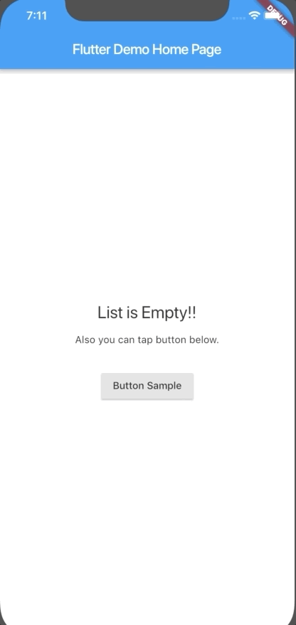

# Centering in SingleChildScrollView

Example of centering in SingleChildScrollView

## tr;dr

```dart
LayoutBuilder(
  builder: (context, constraints) => SingleChildScrollView(
    physics: AlwaysScrollableScrollPhysics(),
    child: ConstrainedBox(
      constraints: BoxConstraints(minHeight: constraints.maxHeight),
      child: Center(child: EmptyView()),
    ),
))
```

## details

[See `lib/main.dart`.](lib/main.dart)

